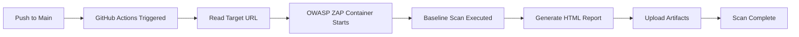

# 🔒 Web DAST - Automated Security Testing with OWASP ZAP


Automated **Dynamic Application Security Testing (DAST)** pipeline for web applications using **OWASP ZAP** integrated with GitHub Actions. This project demonstrates DevSecOps best practices by implementing continuous security testing in CI/CD workflows.

## 📋 Table of Contents

- [Overview](#-overview)
- [Features](#-features)
- [How It Works](#-how-it-works)
- [Prerequisites](#-prerequisites)
- [Usage](#-usage)
- [Scan Results](#-scan-results)
- [Workflow Configuration](#-workflow-configuration)
- [Technologies Used](#-technologies-used)
- [Security Considerations](#-security-considerations)
- [Contributing](#-contributing)
- [License](#-license)
- [Author](#-author)

---

## 🎯 Overview

This repository contains a **CI/CD pipeline** that automatically performs security scans on web applications using **OWASP ZAP (Zed Attack Proxy)**. The scanner identifies common web vulnerabilities based on the **OWASP Top 10** including:

- SQL Injection
- Cross-Site Scripting (XSS)
- Security Misconfigurations
- Broken Authentication
- Sensitive Data Exposure
- XML External Entities (XXE)
- Broken Access Control
- And more...

---

## ✨ Features

- ⚡ **Automated scanning** triggered on every push or PR
- 🔍 **OWASP ZAP integration** for comprehensive vulnerability detection
- 📊 **HTML reports** generated automatically
- 🔄 **GitHub Actions workflow** for seamless CI/CD integration
- 📦 **Artifact storage** for scan results
- 🎯 **Baseline scan mode** for quick vulnerability assessment
- 🛡️ **OWASP Top 10 coverage**

---

## 🔄 How It Works



1. **Trigger**: Push to `main` branch or manual workflow dispatch
2. **Setup**: GitHub Actions runner spins up Ubuntu environment
3. **Target**: Reads target URL from `url.txt`
4. **Scan**: OWASP ZAP performs baseline security scan
5. **Report**: Generates HTML report with findings
6. **Store**: Artifacts uploaded for review

---

## 📦 Prerequisites

- GitHub repository with Actions enabled
- Target web application URL
- Basic understanding of web security concepts

---

## 🚀 Usage

### 1. Clone the Repository

```bash
git clone https://github.com/Jneira00001/test-DAST.git
cd test-DAST
```

### 2. Configure Target URL

Edit the `url.txt` file with your target web application URL:

```bash
echo "https://example.com" > url.txt
```

### 3. Push Changes

```bash
git add url.txt
git commit -m "Update target URL"
git push origin main
```

### 4. Monitor Workflow

Navigate to **Actions** tab in GitHub to monitor the scan progress.

### 5. Download Report

Once completed:
1. Go to the workflow run
2. Scroll to **Artifacts** section
3. Download the HTML report

---

## 📊 Scan Results

The OWASP ZAP scanner generates an **HTML report** containing:

- **Summary** of vulnerabilities found
- **Risk levels**: High, Medium, Low, Informational
- **Detailed findings** with:
  - Vulnerability description
  - Affected URLs
  - Evidence
  - Remediation recommendations
  - CWE/WASC references

### Example Report Structure:

```
📄 ZAP Scanning Report
├── 🔴 High Risk Alerts (0)
├── 🟠 Medium Risk Alerts (2)
├── 🟡 Low Risk Alerts (5)
└── 🔵 Informational Alerts (8)
```

---

## ⚙️ Workflow Configuration

The GitHub Actions workflow is defined in `.github/workflows/main.yml`.

### Key Components:

- **Trigger**: `push` to main branch, `workflow_dispatch` for manual runs
- **Runner**: `ubuntu-latest`
- **OWASP ZAP Action**: Official ZAP baseline scan
- **Scan Type**: Baseline (passive + active)
- **Report Format**: HTML
- **Artifact Retention**: 30 days

### Customization Options:

You can modify the workflow to:
- Change scan depth (baseline → full scan)
- Add authentication
- Configure scan policies
- Integrate with Slack/Email notifications
- Set up security gates (fail on high-risk findings)

---

## 🛠️ Technologies Used

| Technology | Purpose |
|------------|----------|
| **OWASP ZAP** | Dynamic security scanner |
| **GitHub Actions** | CI/CD automation |
| **Docker** | Containerized scanning |
| **Ubuntu** | Runner environment |
| **HTML** | Report generation |

---

## 🔐 Security Considerations

- ⚠️ **Never scan** production systems without authorization
- ⚠️ **Never commit** sensitive credentials or API keys
- ⚠️ **Always review** scan results before sharing
- ⚠️ **Use responsibly** - only scan applications you own or have permission to test
- ⚠️ **Rate limiting** - Some targets may block aggressive scans

### Best Practices:

1. Test against **staging/development environments** first
2. Notify your team before running scans
3. Review and triage findings appropriately
4. Integrate findings into your vulnerability management process

---

## 🤝 Contributing

Contributions are welcome! This is a portfolio/demonstration project.

If you'd like to suggest improvements:

1. Fork the repository
2. Create a feature branch (`git checkout -b feature/improvement`)
3. Commit your changes (`git commit -m 'Add improvement'`)
4. Push to the branch (`git push origin feature/improvement`)
5. Open a Pull Request

---

## 📄 License

This project is licensed under the **MIT License** - see the [LICENSE](LICENSE) file for details.

---

## 👤 Author

**Jneira00001**

- GitHub: [@Jneira00001](https://github.com/Jneira00001)
- Email: jneira.tech2025@gmail.com

---

## 🙏 Acknowledgments

- [OWASP ZAP Team](https://www.zaproxy.org/) for the amazing security tool
- [GitHub Actions](https://github.com/features/actions) for CI/CD platform
- OWASP Top 10 Project

---

## 📚 Additional Resources

- [OWASP ZAP Documentation](https://www.zaproxy.org/docs/)
- [OWASP Top 10](https://owasp.org/www-project-top-ten/)
- [GitHub Actions Documentation](https://docs.github.com/en/actions)
- [DevSecOps Best Practices](https://www.devsecops.org/)

---

<div align="center">

**⭐ If you find this project useful, please consider giving it a star!**

</div>